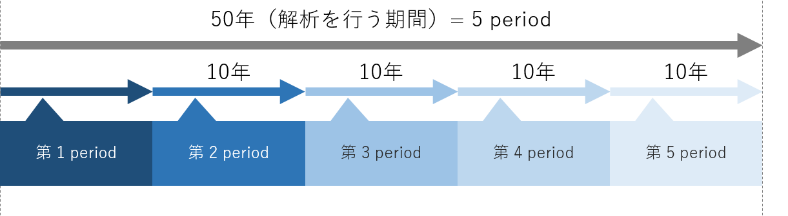

# DAY 1

## 1. エネルギー経済モデル

### 1.1 エネルギー経済モデルの定義
**エネルギーシステムや経済活動を数式化したもの**
    
解析の範囲
: 世界、国、都道府県や州、市区町村、特定の地域など

数式化の方法
: 経済学、工学的理論

* 電力部門を非常に単純なモデルにするとこうなる
  <!-- 図 -->

    


### 1.2 背景 &mdash; エネルギーシステムをモデル化する意義

* 地球温暖化を始めとする環境問題や、途上国でのエネルギーアクセス問題が存在する。（地球温暖化のCO<sub>2</sub>起因説に対する懐疑論者もいらっしゃいますが、中田研では研究の前提として支持する立場です。）
* 解決の選択肢として、様々な技術や政策がある。
政策の例) FIT（固定価格買取制度）、カーボンプライシング

* 技術や政策がエネルギーシステムに及ぼす影響を定量的に評価するには、エネルギーシステムをモデル化し数式で表現する必要がある。

### 1.3 エネルギー経済モデルの分類

#### 1.3.1 解析の目的による分類 

`最適化モデル`
:    費用最小化やCO<sub>2</sub>排出量最小化などの、目的を達成するために必要なエネルギーシステム構成を求める。目的関数（費用やCO<sub>2</sub>排出量など）が最小or最大となるように解析を行う

`シミュレーションモデル`
:    技術の選択基準などが、現在のものと同じと仮定して、将来のエネルギーシステム構成を求める。政策や技術導入が、実際にエネルギーシステム構成に及ぼすであろう影響を解析できる。

#### 1.3.2 モデル化手法による分類

`トップダウンモデル`
:   産業連関表を用いて、エネルギーの最適配分量を求める。エネルギー部門と経済部門の相互作用の解析に用いられる。

`ボトムダウンモデル`
:   資源の採掘から最終消費までの各プロセスを考慮して、エネルギーの最適配分量を求める。技術を導入する場合の影響、技術水準の変化などを解析する場合に用いられる。

**以上をまとめると、下表のようになる。**

<!-- ここで作った https://mamewaza.com/tools/table-generator.html 装飾はいい感じにしてくれ-->

  <div class="clskez3j373"><style scoped>div.clskez3j373{margin:5px;}div.clskez3j373 div.tbl table{width:100%;}div.clskez3j373{padding:0px;}div.clskez3j373{background-color:transparent;}div.clskez3j373 div.tbl th,div.clskez3j373 div.tbl td{border:none;border-bottom:1px solid #000000;padding:5px;}div.clskez3j373 th, div.clskez3j373 td{transparent}div.clskez3j373 div.tbl table{border-collapse:collapse;border-spacing:0;table-layout:fixed;}div.clskez3j373 div.tbl,div.clskez3j373 div.tbl a{color:#000000;}div.clskez3j373 div.tbl{font-size:12px;text-align:;}div.clskez3j373 div.tbl th,div.clskez3j373 div.tbl th a{color:#000000;}div.clskez3j373 div.tbl th{font-weight:bold;text-align:center;}</style><div class="tbl"><table><tr><th rowspan="2">解析の目的</th><th colspan="2">モデル化手法<br /></th></tr><tr><td>トップダウン型</td><td>ボトムアップ型</td></tr><tr><td>最適化モデル</td><td>RICE</td><td>MESSAGE, MARKAL, Calliope<br /></td></tr><tr><td>シミュレーションモデル</td><td>E3MG</td><td>META-Net</td></tr></table></div></div>

<!-- Calliope はボトムアップの最適化モデルなのかは自信がない。EnergyPLAN入れるならどこかな？ -->

### 1.4 時間の表現
<!-- period ってCalliopeで使うっけ？ -->
エネルギーシステム設計において、長期的なシナリオを考える上では解析を行う期間をいくつかに分割する。分割されたそれぞれの期間はperiodといい、エネルギーシステム分析では1 period = 10 yearsとするのが一般的。Calliopeでは最高1時間の時間解像度で計算可能。
<!-- 時間解像度については要チェック -->

<!-- 図 -->
  

### 参考文献
:information_source: 中田研のMETA-Netゼミ資料


## 2. 電力需給に関する基礎知識

### 2.1 設備容量(Installed Capacity)

発電設備における単位時間当たりの最大仕事量。単位はワット（W）あるいは実用的に
キロワット（kW）が用いられる。

### 2.2 設備利用率(Capacity factor)

設備利用率(Capacity Factor)
:対象とする発電設備の実際の発電量が、仮に100%運転を続けた場合に得られる電力量の何%にあたるかを表す数値。具体的には、Load FactorとAvailability Factorの積で定義される。すなわち、
$$
CF = LF \times AF
$$
:information_source: [SBエナジー株式会社, みるみるわかるEnergy|エネルギー用語辞典](https://www.sbenergy.jp/study/dictionary/294.html)

各発電技術における設備利用率の参考値は以下の通り。

| Technology             | 技術                 | Capacity factor [-] | 
| :--------------------- | -------------------- | ------------------: | 
| Nuclear                | 原子力               | 0.66                | 
| Coal-fired             | 石炭火力             | 0.70                | 
| LNG-fired              | LNG火力              | 0.53                | 
| Oil-fired              | 石油火力             | 0.11                | 
| Onshore-wind           | 陸上風力             | 0.20                | 
| Offshore-wind          | 洋上風力             | 0.30                | 
| Geothermal             | 地熱                 | 0.60                | 
| Mega-solar             | メガソーラー         | 0.12                | 
| Hydro                  | 水力                 | 0.45                | 
| Pumped-hydro           | 揚水                 | 0.30                | 
| Biomass                | バイオマス           | 0.60                | 
| Coal-co-firing-biomass | 石炭・バイオマス混焼 | 0.60                | 

:information_source: 臼井さんのゼミ資料

`Load Factor`
:    発電設備が設備容量の何%にあたる出力で発電するかを表す数値。

`Availability Factor`
:    発電設備が稼働している時間がフル稼働の何%にあたるかを表す数値。例えば、急激な出力調整ができない原子力発電では比較的高いが、日照時間に左右される太陽光発電では低くなる。

Calliopeでエネルギーシステムモデルを作成する場合は、各発電設備について必ず指定しなければならないパラメータであり、結果にも影響を及ぼすので非常に重要。

設備容量を \\( IC [\mathrm{kW}]\\) 、設備利用率を\\( CF \\)とすると、年間電力発電量は
$$
IC[\mathrm{kW}] \times 8760 ~[\mathrm{h}] \times CF
$$
で求められる。

### 2.3 電源構成（エネルギーミクス）
<!-- あああああ -->

電力需要は季節や時間によって刻々と変化するが、現状、大量に蓄電しておくことは難しいため、過不足がないように供給量を追随させる必要がある。このため、電力会社はエネルギー資源の特性を活かした電源構成で電力の供給を行っている。ここでいう「特性」とは様々な観点での分類が考えられるが、出力変動の可変性に応じて「ベースロード電源」、「ミドル電源」、「ピーク電源」がある。

`ベースロード(Baseload)電源`
:    運用コストが安く、昼夜問わず安定して稼働できる電源。石炭火力発電、流込式の水力発電、原子力発電、地熱発電など。ただし、建設費は高い。

`ミドル(Mid-load)電源`
:    ベースロード電源の次に発電コストが安く、ベースロード電源だけでは需要に対応できない場合に稼働する電源。出力調整が可能で、LNG火力発電などがこれ。

`ピークロード(Peak load)電源`
:    発電コストは高いが、出力変動が容易な電源。石油火力発電や揚水発電。
:information_source: [エネルギーミックス｜エネルギー事情｜東京電力ホールディングス株式会社](https://www.tepco.co.jp/electricity/energy_situation/bestmix.html)


:information_source: [IEAのtwitter](https://twitter.com/iea/status/614186782335365120)


## 3. Calliope のインストール

## 3.1 Anaconda のインストール

Anaconda3をインストールする。[ここから](https://www.anaconda.com/products/individual)ダウンロードできる。

PCにAnacondaをインストールしたら、Pythonパッケージのインストールに```pip```を使うと環境が破壊されてしまうことがあるので、```conda```を使うようにする。たいていのパッケージは```conda```でも提供されている。万が一```pip```コマンドでパッケージをインストールした後に環境が動かなくなった際は、Anacondaを再インストールすることが手っ取り早い解決策である。 [参考サイト](http://onoz000.hatenablog.com/entry/2018/02/11/142347)


## 3.2 Visual Studio Code のインストール

[ここから](https://code.visualstudio.com/)ダウンロードできる。どうしてもEmacsなど他のエディタがいい人は黙ってて。

[Japanese Language Pack for Visual Studio Code](https://marketplace.visualstudio.com/items?itemName=MS-CEINTL.vscode-language-pack-ja)という拡張機能を入れるとUIが日本語になる。

## 3.3 PowerShell の設定と基本的なコマンド

ターミナルとしてPowerShellを使う。Windows環境ではコマンドプロンプトのほうがメジャーであるが、言語として古く、更新もされていないためお勧めしない。Mac & Linuxの人は標準のターミナルを使えば大丈夫。

PowerShellはWindowsに最初からインストールされているため、インストールする必要はない。しかし、Windowsに同梱されているPowershellは最新版ではないので、気になる人は[ここから](https://github.com/PowerShell/PowerShell)最新版をダウンロード・インストールできる。

### 3.3.1 PowerShell の設定

PowerShellのスクリプトを実行できるように実行ポリシーを変更する。

1. PowerShellを管理者権限で立ち上げる。
1. ```Set-ExecutionPolicy RemoteSigned```　をコピペして実行。PowerShellを閉じる。

PowerShellにAnacondaへのパスを通す。

1. スタートメニューのAnacondaフォルダにある「Anaconda Powershell Prompt」を立ち上げる。
1. ```conda init``` をコピペして実行。「Anaconda Powershell Prompt」を閉じる。
1. PowerShellを起動して```conda -V```を入力。エラーが出なければおｋ！

### 3.3.2 PowerShell の基本的なコマンド

PowerShellのコマンド（正式にはコマンドレットと呼ぶ）は、```<動詞>-<名詞>```の命名規則に従っている。例えば、ディレクトリ移動する時のコマンドは```Set-Location```と定義されている。しかし、いちいちディレクトリ移動の度にこの長いコマンドを入力していると日が暮れるので、よく使うコマンドにはエイリアスが定義されており、ディレクトリ移動には```cd```や```chdir```などが定義されている。そのため、基本的な操作はLinuxと同じコマンドで操作できる。おそらく学部生時にLinuxの基本的なコマンドは習っていると思うが、一応軽く紹介しておく。

| コマンド | 説明 |
|  ----   | ---- |
| cd | ディレクトリ移動 |
| ls | フォルダの内容を表示する |
| mv | ファイルを移動 |
| cp | ファイルなどをコピーする |
| mkdir | フォルダを作成する |
| rm | ファイルやフォルダを削除する |
| pwd | 現在いる場所を表示する |

## 3.4 Calliopeのインストール

PowerShellを開き、以下のコマンドを実行する。
```
conda create -c conda-forge -n calliope calliope
```

Calliopeを使うときは以下のコマンドを入力してcalliope環境を起動する。
```
conda activate calliope
```
PowerShellの先頭に(calliope)が表示されていれば準備完了！

## 3.5 Gurobiのインストール

Calliopeの実行には何かしらのソルバーが必要である。大学のPCにインストールするときは、[このサイト](https://qiita.com/keisukesato-ac/items/b0425a879622b99a2610)を参考にGurobiをインストールして、無償のアカデミックライセンスを取得すること。

Gurobiのアカデミックライセンスを取得できない時（大学LANからアクセスできないなど）は、CPLEXの学生版でもよい。

<!-- test -->
<!-- test -->
<!-- test -->
<!-- test -->

