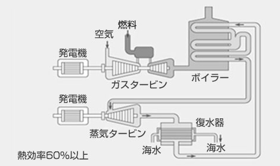

# DAY 1

## 1. エネルギー経済モデル

### 1.2 エネルギー経済モデルの定義
**エネルギ ーシステムや経済活動を数式化したもの**
    
<dl>
<dt>解析の範囲</dt>
<dd>世界、国、都道府県や州、市区町村、特定の地域など</dd>
<dt>数式化の方法</dt>
<dd>経済学、工学的理論</dd>
</dl>

* 電力部門を非常に単純なモデルにするとこうなる

### 1.3 背景 &mdash; エネルギーシステムをモデル化する意義

* 地球温暖化を始めとする環境問題や、途上国でのエネルギーアクセス問題が存在する。（地球温暖化のCO2起因説に対する懐疑論者もいらっしゃいますが、中田研では研究の前提として支持する立場です。）
* 解決の選択肢として、様々な技術や政策がある。
ex.) FIT

* 技術や政策がエネルギーシステムに及ぼす影響を定量的に評価するには、エネルギーシステムをモデル化し数式で表現する必要がある。

### 1.4 エネルギー経済モデルの分類

#### 解析の目的による分類

- 最適化モデル
  - 費用最小化やCO2排出量最小化などの、目的を達成するために必要なエネルギーシステム構成を求める。目的関数（費用やCO2排出量など）が最小or最大となるように解析を行う

- シミュレーションモデル
  - 技術の選択基準などが、現在のものと同じと仮定して、将来のエネルギーシステム構成を求める。政策や技術導入が、実際にエネルギーシステム構成に及ぼすであろう影響を解析できる。

#### モデル化手法による分類

- トップダウンモデル
  - 産業連関表を用いて、エネルギーの最適配分量を求める。エネルギー部門と経済部門の相互作用の解析に用いられる。

- ボトムダウンモデル
  - 資源の採掘から最終消費までの各プロセスを考慮して、エネルギーの最適配分量を求める。技術を導入する場合の影響、技術水準の変化などを解析する場合に用いられる。

以上をまとめると、下表のようになる。

  |解析の目的|モデル化手法    |   |
  |:--|:-:|--:|
  |   |トップダウンモデル|ボトムアップモデル|
  |最適化モデル|RICE|MESSAGE, MARKAL, Calliope?|
  |シミュレーションモデル|E3MG|META-Net|
  <!-- obsoleteなモデルが含まれていないか要チェック&改訂 -->

## 3. 要素技術
Calliopeでは様々な発電所や熱プラントを扱うことができる。ここでは日本でよく用いられている発電所について説明する。

### 3.1 火力発電

#### 汽力
汽力発電とは、高圧の水蒸気でタービンを回して電力へ変換する発電方法である。義務教育で習う火力発電所の仕組みは汽力発電であることが多い。高圧の水蒸気を作れれば発電できるため、多種多様な燃料を使うことができる。代表的な燃料として、石油、天然ガス、高炉ガス、石炭、コークス、木質チップがある。発電効率は40％ほど。

:information_source:https://www.jera.co.jp/business/thermal-power/type

#### ガスタービン
ガスタービン発電とは、圧縮空気と燃料ガスを燃焼器で燃焼させ、発生した高温高圧の排気ガスをガスタービンに吹き付けて発電する発電方式である。航空機に使われているジェットエンジンに発電機を取り付けたようなイメージである。非常に高速に回転しているガスタービンに排気ガスを直接吹き付けるため、不純物の少ない燃料しか使用できない。天然ガスや灯油、軽油が主に使われている。

#### コンバインドサイクル

コンバインドサイクル発電とは、ガスタービン発電の排熱で汽力発電を行う発電方法である。

##### コンバインドサイクルガスタービン発電 (CCGT)

ガスタービンからの排気から熱を回収し、回収熱でもう一度発電を行うため、発電効率60%程度と高い。

:information_source: https://www.mhps.com/jp/products/gtcc/

##### 石炭ガス化複合発電(IGCC)

石炭をガス化し、それを用いてコンバインドサイクル発電を行う。発電効率は50％程度と従来の石炭火力と比較して約10％よい。

#### 内燃

内燃発電とは所謂「エンジン」を用いた発電方法である。燃料は軽油やガソリン、LPGが用いられる。島しょ部に多い。

### 3.2 水力発電

水力発電は高所から落下する水のエネルギーを利用して発電する。再エネ発電の一種ではあるが、設置できる場所が限られており、今後の新設は見込まれない。ただ発電するものと、夜間などの余剰電力で水をくみ上げ、電力需要がひっ迫した際にくみ上げておいた水で発電する「揚水式水力発電所」というものが存在する。以下に揚水式水力発電所の模式図を示す。

:information_source:https://www.fepc.or.jp/enterprise/hatsuden/water/yousuishiki/index.html

### 3.3 原子力発電

### 3.4 再エネ発電

#### 3.4.1 太陽光

#### 3.4.2 風力

#### 3.4.3 その他

## 5. Calliope のインストール

## 5.1 Anaconda のインストール

Anaconda3をインストールする。[ここから](https://www.anaconda.com/products/individual)ダウンロードできる。

## 5.2 Visual Studio Code のインストール

[ここから](https://code.visualstudio.com/)ダウンロードできる。どうしてもEmacsなど他のエディタがいい人は黙ってて。

## 5.3 PowerShell の設定と基本的なコマンド

ターミナルとしてPowerShellを使う。Windows環境ではコマンドプロンプトのほうがメジャーであるが、言語として古く、更新もされていないためお勧めしない。

## 5.4 Calliopeのインストール
