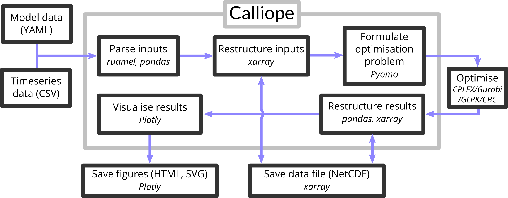
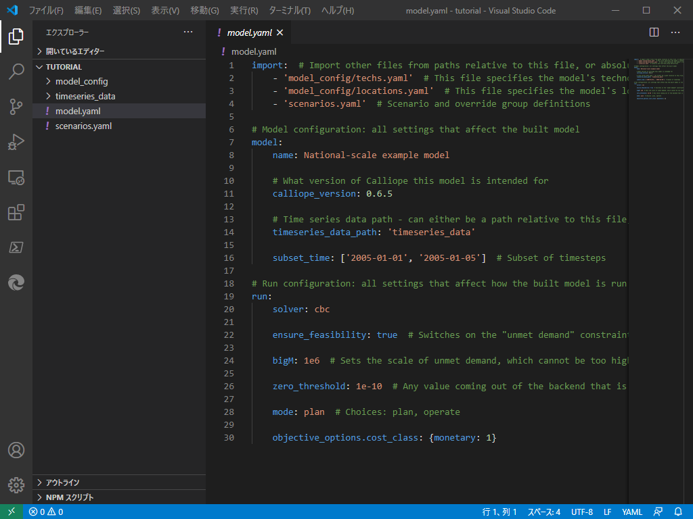

# DAY 2

## 1. Calliopeの概要

### 1.1 Calliopeとは

Calliopeはチューリッヒ工科大により開発された、エネルギーシステムモデリングフレームワークである。モデルは、YAMLというファイル形式で記述される。セクターカップリングを前提に開発されたものではないが、柔軟に設定することができるので、セクターカップリング関係の研究にも用いることができる。ソルバーは外部依存で、GLPKやGurobi、CPLEXを使うことができる。公式ドキュメント(English)は[こちら](https://calliope.readthedocs.io/en/stable/index.html)。


Calliopeを使用したモデリングの基本的なプロセスは、3つのステップに基づく。

  1. ゼロから、または既存のモデルを調整してモデルを作成する（モデルの構築）

  2. モデルを実行する（モデルを実行する）

  3. モデル結果の分析と視覚化（モデルの分析）

:information_source: 天野のゼミ資料

### 1.2 用語
ここで定義されている用語は、ドキュメント、モデルコード、および構成ファイル全体で使用される。

`Technology`
:     エネルギーを生産、消費、変換、または輸送するテクノロジー

`Place`
:    複数の技術を含めることができ、エネルギー・バランシングのために他の場所を含めることができる場所

`Resource`
:    技術を用いてシステムにエネルギーを導入したり、システムからエネルギーを取り出したりするためのエネルギーのソース（または貯蔵施設）

`Career`
:    エネルギー担体、例えば、electricity（電気）、またはheat（熱）。


制約付き最適化ではより一般的に、次の用語も使用される。

`Parameter`
:    モデル方程式に入力される定数

`Variable`
:    モデル方程式に入る変数係数（決定変数）

`Set`
:    方程式の代数的定式化におけるインデックス

`Constraint`
:    1つまたは複数の変数を制約する等式または不等式

### 1.3 Calliopeの特徴
* 解析する期間をいくつかに分割して表現（次節で解説）。
* 資源の採掘から最終消費までの各エネルギープロセスをノードとして表現。
* ノードのネットワーク（ノード間を互いにパスでつないだもの）によってエネルギーシステムを表現。

### 1.4 Calliopeの内部処理

Calliopeの内部処理について紹介する。Calliopeは以下の図のようなフローで処理している。



Calliopeとはそもそも、入力されたデータを線形ソルバーでの最適化のために準備し、結果を分析・保存するためのソフトウェアである。データ入力は、次の入門ゼミ資料で取り上げるが、YAMLとCSVという形式で行われる。入力されたデータはruamel、pandas、xarrayといったライブラリで処理された後、Pyomoに渡される。Pyomoは最適化モデルを生成する、ソフトウェアパッケージであり、GAMSのようなシステムである。Pyomoは、処理したデータを最適化ソルバーが読める形式に変換し、外部の最適化ソルバー（Gurobi、CPELX、GLPKなど）に流す。最適化ソルバーから帰ってきた処理結果は再びpandasとxarrayによって処理されて出力される。また、Plotlyを使って可視化も行うことができる。

:information_source: [Calliope公式ドキュメンテーション](https://calliope.readthedocs.io/en/stable/index.html)
 
## 2. Calliope のチュートリアル

### 2.1 YAMLの書き方

Calliopeの設定ファイルは、`YAML`（ヤムル）という形式で書かれている。この形式は、コンピュータにも人間にも読みやすいようにできており、`XML`や`JSON`といった形式と似たような役割である。拡張子は`.yml`か`.yaml`が用いられる。この入門資料では、Calliopeを回す際に知っておいたほうが良い部分のみ解説する。

#### リスト
リストはハイフン`-`で表現するか、`{}`で要素を囲う。例えば、
```YAML
# - を使った書き方
- リンゴ
- ゴリラ
- ラッパ

# {}を使った書き方
{リンゴ, ゴリラ, ラッパ}
```
のように記述する。

#### 連想配列
連想配列とは、値に名前を付けて管理できる配列である。Pythonでは辞書形配列とも呼ばれる。連想配列は以下のように記述する。
```YAML
key: value
key2: value2
```
Calliopeの設定ファイルでは、入れ子構造にした連想配列（連想配列のなかに連想配列がある）がとてもよく用いられる。
```YAML
key1:
  key2: value
  key3: value3

# 次のように書いてもよい

key1.key2: value
```
なお、YAMLではインデント（字下げ）にスペースのみを使い、スペース二個単位でインデントすることが多い。コメントアウトは`#`を使う。

### 2.2 実行ファイルの構造

!!!note 
    詳しくは[公式ドキュメント](https://calliope.readthedocs.io/en/stable/user/building.html)を参照されたい

Calliopeの実行ファイルは、おおむね以下のような構造になっている。
```
+ example_model
    + model_config
        - locations.yaml
        - techs.yaml
    + timeseries_data
        - solar_resource.csv
        - electricity_demand.csv
    - model.yaml
    - scenarios.yaml
```
Calliope実行時に呼び出す設定ファイルは`model.yml`であり、この`model.yml`ファイルに他のYAMLドキュメントを呼び出す記載をしていく。

### 2.3 公式チュートリアルを動かしてみる

とりあえず、手元のコンピュータでチュートリアルファイルを動かしてみよう。まずは実行ファイルを置く場所を適当に作って移動する。例えば、
```bash
mkdir calliope
cd calliope
```
のようにする。別に場所はどこでも構わない。

次に、Calliopeのチュートリアルをコピーする。`calliope new`コマンドを使うと自動でコピーすることができる。
```bash
# 前回作製したcalliope環境を起動する
conda activate calliope
# サンプルコードを'tutorial'という名前のフォルダに展開する
calliope new tutorial
# 'tutorial'フォルダをVSCodeで開く
code tutorial
```
以上の一連のコマンドを入力すると、tutorialフォルダにサンプルコードが自動でコピーされ、VSCodeで開かれたと思う。デフォルトの設定ではソルバーに`cbc`が指定されているので、前回インストールした`gurobi`又は`CPLEX`に設定しなおす必要がある。ソルバーの設定は`model.yml`に記載があるので開いて編集する。



おそらく、開くとこのようになっていると思う。ソルバーは20行目あたりに記載があるので、
```yaml
    solver: gurobi
```
と書き換える。書き換えたら上書き保存しておく。

モデルの実行にもコマンドを使う。実行するときはVSCode内でターミナル（PowerShell）を開くと見やすいのでおすすめ。++ctrl+shift+grave++ (環境によっては ++ctrl+shift++ + @ )を押すとVSCode内にターミナルを開くことができる。上部のツールバーからでも開ける。

とりあえず実行だけしてみる。ターミナルに次のコマンドを入力する。
```powershell
# calliope環境が読み込まれてないとき
conda activate calliope

# model.yamlを指定して実行
calliope run .\model.yaml
```
実行すると、なにやら文字が流れる。最終行に`Calliope run complete.`とあればきちんと計算が回っている。何かエラーメッセージがでた場合は相談してほしい。以上でcalliopeのチュートリアルモデルを実行することはできたが、実は結果が保存されていない。実行コマンドにオプションをつけることで結果の保存形式を指定することができる。例えば、csvファイルで保存したいときは、`--save_csv={directory name}`を、グラフをhtmlで保存したいときは`--save_plots={filename.html}`と実行コマンドの後に続けて書く。例えば以下のようにすると、`outputs`フォルダに結果のcsvが、`model.yaml`と同じ階層に`output_plot.html`が保存される。
``` powershell
calliope run .\model.yaml --save_csv=outputs --save_plots=output_plot.html
``` 

## 3. エネルギーモデルの作製

それでは、オリジナルのエネルギーシステムモデルを作製し、分析してみよう。

### 3.1 作製するモデルの詳細

今回作成するエネルギーシステムは、対象地域を東北電力管内（東北六県+新潟県）として、電力需要のみを考慮する。各県の電力需要と、太陽光発電ポテンシャル、洋上風力発電ポテンシャルの推計値を入力とし、東北電力管内で電力を賄った際の電力の流れを可視化する。各県を以下の図のように接続し、電力を融通する。


### 3.2 下準備

今回はチュートリアルモデルをベースにモデルを作製する。先ほどと同様に、適当なディレクトリにチュートリアルモデルをコピーする。
```bash
calliope new test_model
code test_model
```
!!! Tips
    `calliope`コマンドでエラーが出る際は、`conda activate calliope`でcalliope環境に入ろう。

次にモデルで入力として使う、時系列データをダウンロードする。
<!-- ダウンロードリンクが決まり次第追記する -->

### 3.3 `model.yaml`を編集

??? cite "デフォルト"
        import:  # Import other files from paths relative to this file, or absolute paths
            - 'model_config/techs.yaml'  # This file specifies the model's technologies
            - 'model_config/locations.yaml'  # This file specifies the model's locations
            - 'scenarios.yaml'  # Scenario and override group definitions

        # Model configuration: all settings that affect the built model
        model:
            name: National-scale example model

            # What version of Calliope this model is intended for
            calliope_version: 0.6.5

            # Time series data path - can either be a path relative to this file, or an absolute path
            timeseries_data_path: 'timeseries_data'

            subset_time: ['2005-01-01', '2005-01-05']  # Subset of timesteps

        # Run configuration: all settings that affect how the built model is run
        run:
            solver: cbc

            ensure_feasibility: true  # Switches on the "unmet demand" constraint

            bigM: 1e6  # Sets the scale of unmet demand, which cannot be too high, otherwise the optimisation will not converge

            zero_threshold: 1e-10  # Any value coming out of the backend that is smaller than this (due to floating point errors, probably) will be set to zero

            mode: plan  # Choices: plan, operate

            objective_options.cost_class: {monetary: 1}  


ソルバーに`gurobi`を指定する。

### 3.4 `locations.yaml`を編集

??? cite "デフォルト"
        ##
        # LOCATIONS
        ##

        locations:
            # region-1-start
            region1:
                coordinates: {lat: 40, lon: -2}
                techs:
                    demand_power:
                        constraints:
                            resource: file=demand-1.csv:demand
                    ccgt:
                        constraints:
                            energy_cap_max: 30000 # increased to ensure no unmet_demand in first timestep
            # region-1-end
            # other-locs-start
            region2:
                coordinates: {lat: 40, lon: -8}
                techs:
                    demand_power:
                        constraints:
                            resource: file=demand-2.csv:demand
                    battery:

            region1-1.coordinates: {lat: 41, lon: -2}
            region1-2.coordinates: {lat: 39, lon: -1}
            region1-3.coordinates: {lat: 39, lon: -2}

            region1-1, region1-2, region1-3:
                techs:
                    csp:
            # other-locs-end

        ##
        # TRANSMISSION CAPACITIES
        ##

        links:
            # links-start
            region1,region2:
                techs:
                    ac_transmission:
                        constraints:
                            energy_cap_max: 10000
            region1,region1-1:
                techs:
                    free_transmission:
            region1,region1-2:
                techs:
                    free_transmission:
            region1,region1-3:
                techs:
                    free_transmission:
            # links-end


### 3.5 `techs.yaml`を編集

??? cite "デフォルト"
        ##
        # TECHNOLOGY DEFINITIONS
        ##

        # Note: '-start' and '-end' is used in tutorial documentation only

        techs:

            ##
            # Supply
            ##

            # ccgt-start
            ccgt:
                essentials:
                    name: 'Combined cycle gas turbine'
                    color: '#E37A72'
                    parent: supply
                    carrier_out: power
                constraints:
                    resource: inf
                    energy_eff: 0.5
                    energy_cap_max: 40000  # kW
                    energy_cap_max_systemwide: 100000  # kW
                    energy_ramping: 0.8
                    lifetime: 25
                costs:
                    monetary:
                        interest_rate: 0.10
                        energy_cap: 750  # USD per kW
                        om_con: 0.02  # USD per kWh
            # ccgt-end

            # csp-start
            csp:
                essentials:
                    name: 'Concentrating solar power'
                    color: '#F9CF22'
                    parent: supply_plus
                    carrier_out: power
                constraints:
                    storage_cap_max: 614033
                    energy_cap_per_storage_cap_max: 1
                    storage_loss: 0.002
                    resource: file=csp_resource.csv
                    resource_unit: energy_per_area
                    energy_eff: 0.4
                    parasitic_eff: 0.9
                    resource_area_max: inf
                    energy_cap_max: 10000
                    lifetime: 25
                costs:
                    monetary:
                        interest_rate: 0.10
                        storage_cap: 50
                        resource_area: 200
                        resource_cap: 200
                        energy_cap: 1000
                        om_prod: 0.002
            # csp-end

            ##
            # Storage
            ##
            # battery-start
            battery:
                essentials:
                    name: 'Battery storage'
                    color: '#3B61E3'
                    parent: storage
                    carrier: power
                constraints:
                    energy_cap_max: 1000  # kW
                    storage_cap_max: inf
                    energy_cap_per_storage_cap_max: 4
                    energy_eff: 0.95  # 0.95 * 0.95 = 0.9025 round trip efficiency
                    storage_loss: 0  # No loss over time assumed
                    lifetime: 25
                costs:
                    monetary:
                        interest_rate: 0.10
                        storage_cap: 200  # USD per kWh storage capacity
            # battery-end

            ##
            # Demand
            ##
            # demand-start
            demand_power:
                essentials:
                    name: 'Power demand'
                    color: '#072486'
                    parent: demand
                    carrier: power
            # demand-end

            ##
            # Transmission
            ##

            # transmission-start
            ac_transmission:
                essentials:
                    name: 'AC power transmission'
                    color: '#8465A9'
                    parent: transmission
                    carrier: power
                constraints:
                    energy_eff: 0.85
                    lifetime: 25
                costs:
                    monetary:
                        interest_rate: 0.10
                        energy_cap: 200
                        om_prod: 0.002

            free_transmission:
                essentials:
                    name: 'Local power transmission'
                    color: '#6783E3'
                    parent: transmission
                    carrier: power
                constraints:
                    energy_cap_max: inf
                    energy_eff: 1.0
                costs:
                    monetary:
                        om_prod: 0
            # transmission-end
