# DAY3

それでは、オリジナルのエネルギーシステムモデルを作製し、分析してみよう。

## 作製するモデルの詳細

今回作成するエネルギーシステムは、対象地域を東北電力管内（東北六県+新潟県）として、電力需要のみを考慮する。各県の電力需要と、太陽光発電ポテンシャル、洋上風力発電ポテンシャルの推計値を入力とし、東北電力管内で電力を賄った際の電力の流れを可視化する。各県を以下の図のように接続し、電力を融通する。



## 下準備

今回はチュートリアルモデルをベースにモデルを作製する。先ほどと同様に、適当なディレクトリにチュートリアルモデルをコピーする。
```bash
calliope new test_model
code test_model
```
!!! Tips
    `calliope`コマンドでエラーが出る際は、`conda activate calliope`でcalliope環境に入ろう。

次にモデルで入力として使う、時系列データをダウンロードする。
<!-- ダウンロードリンクが決まり次第追記する -->

## `model.yaml`を編集
`model.yaml`では、Calliopeの実行に関するすべてを設定する。以下三つに大きく分けて設定する。

:information_source: [Calliope公式ドキュメント](https://calliope.readthedocs.io/en/stable/user/config_defaults.html#config-reference-model)

### `import`

```yaml
import:  
    - 'model_config/techs.yaml' 
    - 'model_config/locations.yaml' 
    - 'scenarios.yaml' 
```
`import`にはCalliopeの解析に必要な設定ファイルを分散して書いた際に、そのファイルの場所を記述する。

各需要家や供給元のデータ、それぞれの位置情報などをすべて同じファイルに記載することもできるが、そうすると大変読みにくくなってしまうので、通常はファイルを分けて記載する。この資料でも、`techs.yaml`、`locations.yaml`に分割して記載する。

今回は同じ場所にファイルを置くので編集する必要はない。

### `model`

```yaml
model:
    name: National-scale example model
    calliope_version: 0.6.5
    timeseries_data_path: 'timeseries_data'
    subset_time: ['2005-01-01', '2005-01-05']
```
`model`には実行したいモデルの設定を記述する。

`timeseries_data_path`にはその名の通り、計算に使う時系列データの場所を指定する。

`subset_time`で使用するデータの範囲を選択することができる。実際には１年間分のデータがあったとしても、設定ファイルが正しいか確かめるために1年間の計算をいちいちする必要は無いので、一部のデータだけで確かめるためなどに使う。

今回は、例と同じ時間範囲のデータを扱うので編集する必要はない。nameは変えたい人は変えてもよい。

### `run`

```yaml
run:
    solver: cbc
    ensure_feasibility: True
    bigM: 1e6
    zero_threshold: 1e-10 
    mode: plan
    objective_options.cost_class: {monetary: 1}
```
`run`では、計算方法に関する設定を記述する。

`solver`では、最適化計算に用いるソルバーを指定する。デフォルトでは`cbc`になっているが、今回は`gurobi`を指定する。

`ensure_freasibility`は、Trueにすると、供給が需要を満たせないときでも計算を続行する。Falseにすると、需要と供給のアンマッチが発生した場合、最適化計算は失敗する。

`bigM`は、需要を満たせないときに使用される。モデルが到達しうる最大のコストくらいの大きさの値であるべきであり、大きすぎると計算が収束しない。

`zero_threshold`よりも小さい値はおそらく浮動小数点エラーであるため、削除する。

`mode`では最適化計算のモードを選択する。Calliopeには`plan`、`operate`、`spores`の三つのモードがある。planモードでは容量がモデルによって決定される、つまり、ゼロからエネルギーシステムを設計する際に適している。operateモードでは、容量は固定され、システムがモデル予測制御（MPC）によって運用される。つまり、既存の設備を用いたエネルギーシステムの最適化に適している。sporesモードでは、最初にplanモードで実行し、その後、似たようなコストだが、設備の容量と場所がもっとも異なる物を見つける。そのため、モデルはN回実行される。

今回はsolverをgurobiに変更するのみで良い。

:information_source: [MPCに関して深く知りたい方はこちら](https://myenigma.hatenablog.com/entry/2016/07/25/214014)
:information_source: [MPCとエネルギーシステム](https://orbit.dtu.dk/en/publications/model-predictive-control-for-smart-energy-systems-2)

## `techs.yaml`を編集

`techs.yaml`は`model_config`フォルダの中にある。ここでは各ノードについて詳しく設定する。

まず、発電

```yaml

```

## `locations.yaml`を編集        