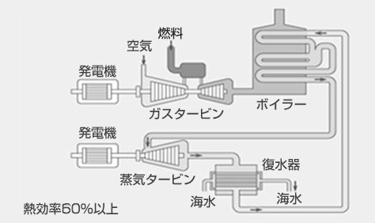

# **入門ゼミ2020　Calliope講座#1**

2020年 7月

M1　末松 天地  天野 哲

# 目次

[TOC]

# 3. 要素技術
Calliopeでは様々な発電所や熱プラントを扱うことができる。ここでは日本でよく用いられている発電所について説明する。

- 3.1 火力発電
    - 汽力
    - ガスタービン
    - コンバインドサイクル
    - 内燃
- 3.2 水力発電
- 3.3 原子力発電
- 3.4 再エネ発電
    - 太陽光
    - 風力
    - その他

## 3.1 火力発電

### 汽力
汽力発電とは、高圧の水蒸気でタービンを回して電力へ変換する発電方法である。義務教育で習う火力発電所の仕組みは汽力発電であることが多い。高圧の水蒸気を作れれば発電できるため、多種多様な燃料を使うことができる。代表的な燃料として、石油、天然ガス、高炉ガス、石炭、コークス、木質チップがある。

### ガスタービン
ガスタービン発電とは、圧縮空気と燃料ガスを燃焼器で燃焼させ、発生した高温高圧の排気ガスをガスタービンに吹き付けて発電する発電方式である。航空機に使われているジェットエンジンに発電機を取り付けたようなイメージである。非常に高速に回転しているガスタービンに排気ガスを直接吹き付けるため、不純物の少ない燃料しか使用できない。天然ガスや灯油、軽油が主に使われている。

### コンバインドサイクル

#### コンバインドサイクルガスタービン発電 (ccgt)

ガスタービンからの排気から熱を回収し、回収熱でもう一度発電を行うため、発電効率が高い。

:information_source: https://www.mhps.com/jp/products/gtcc/

### 内燃

内燃発電とは所謂「エンジン」を用いた発電方法である。燃料は軽油やガソリン、LPGが用いられる。島しょ部に多い。

## 3.2 水力発電

## 3.3 原子力発電

## 3.4 再エネ発電

# 5. Calliope のインストール
## Steps

1. Anaconda のインストール
1. Visual Studio Code のインストール
1. PowerShell の設定と基本的なコマンド
1. Calliopeのインストール

# 5.1 Anaconda のインストール

Anaconda3をインストールする。

# 5.2 Visual Studio Code のインストール

ググって

# 5.3 PowerShell の設定と基本的なコマンド

ターミナルとしてPowerShellを使う。Windows環境ではコマンドプロンプトのほうがメジャーであるが、言語として古く、更新もされていないためお勧めしない。

# 5.4 Calliopeのインストール
